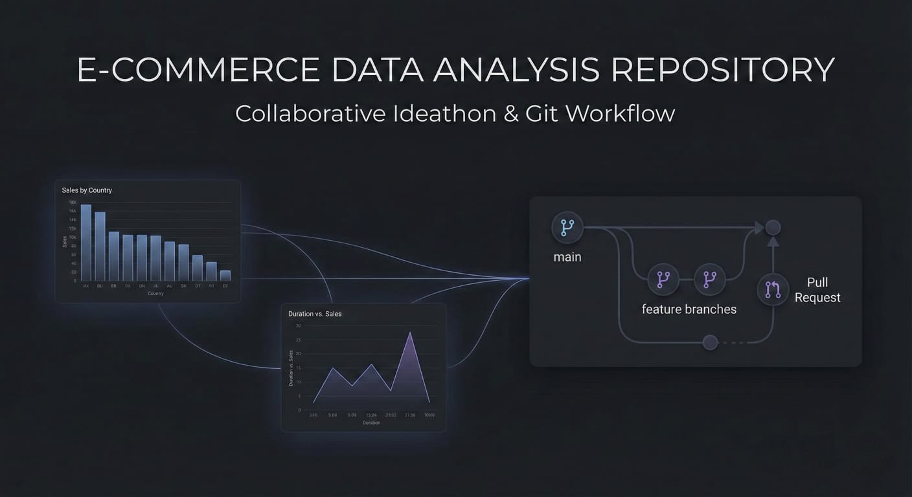
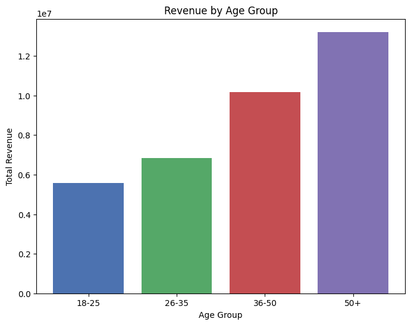
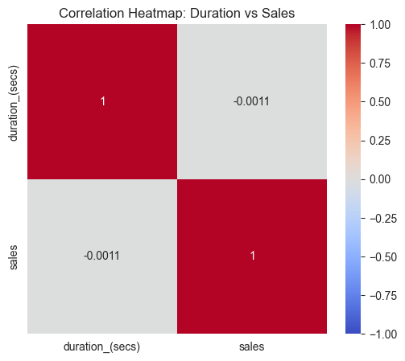
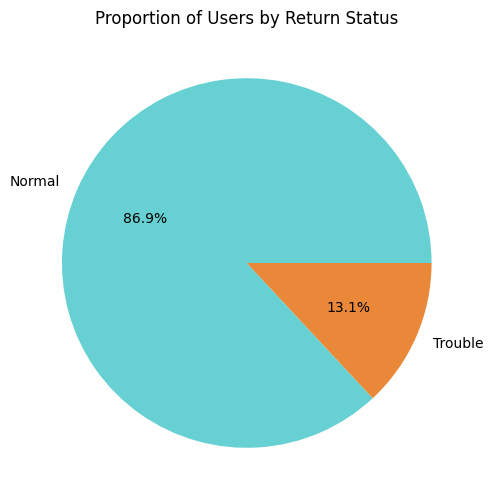
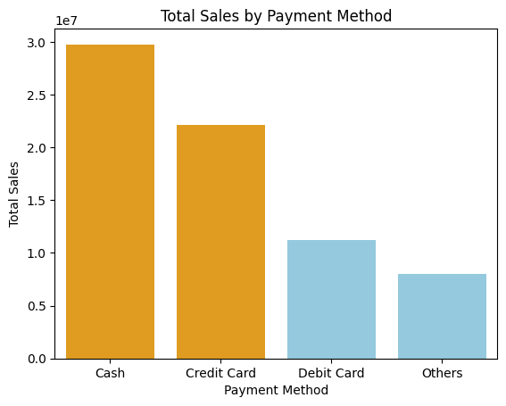

  

 
A collaborative Ideathon project exploring real-world user behaviour, sales patterns, and insights from an e-commerce dataset.
  

##  Overview

This repository contains a team-based exploratory data analysis (EDA) project developed as part of our Ideathon participation.

Our goal is to:

> Analyze an e-commerce dataset, uncover patterns, visualize insights, and collaboratively build a clean analytical portfolio using Git, GitHub workflows, and Jupyter Notebooks.

Each team member contributes individual analyses through feature branches and pull requests, ensuring a professional and conflict-free workflow.

---

##  Dataset Description

The dataset consists of multiple features representing real user activity on an e-commerce platform. Below are the key attributes:

| Feature | Description |
| :--- | :--- |
| **AccessDate** | Date & time when the user accessed the website |
| **DurationSeconds** | Total time spent on the platform |
| **NetworkProtocol** | Indicates whether the user accessed via HTTP/HTTPS |
| **IPAddress** | Masked IP region of the user |
| **BytesConsumed** | Total data consumed during the session |
| **Browser** | Browser used (Chrome, Firefox, Safari, etc.) |
| **Age** | Age of the user |
| **Gender** | Gender information |
| **Country** | Location of the user |
| **Membership** | Normal or Premium membership type |
| **Language** | Website language selected |
| **Sales** | Sales amount generated |
| **Returned** | Whether a product return took place |
| **ReturnedAmount** | Amount refunded for returns |
| **PaymentMethod** | Mode of payment (UPI, Card, COD, etc.) |

This structured dataset allows for meaningful segmentation, behavioural analysis, and performance insights.

---

##  Objectives

* Clean and preprocess the dataset
* Identify behavioural & demographic trends
* Visualize patterns using effective plots
* Understand the business impact of attributes (age, country, browser, etc.)
* Perform comparative analysis across different user groups
* Build a high-quality, structured, collaborative data-science repository
* Showcase teamwork, analysis skills, and Git/GitHub workflow mastery

---
##  Tech Stack

  
  
  
  
  
  

---

##  Example Analyses Performed

This repository includes multiple analyses by different contributors, such as:

* Browser-wise Sales Contribution
* Country-wise Sales Performance
* Age Group vs Purchase Behaviour
* Membership Type vs Average Sales
* Return Behaviour Patterns
* Payment Method Preferences
* Duration vs Sales Relationship

  
  

  
  

*Team members may include plot images directly inside their Jupyter notebooks for clarity.*

---

## 🛡 License

This project is licensed under the MIT License.
See the [LICENSE](LICENSE) file for details.

---

##  Discussions

We use GitHub Discussions to:

* Ask questions
* Share plot ideas
* Seek help with Git, VS Code, or Python
* Suggest improvements
* Collaborate openly

Everyone is encouraged to participate.

---

##  Team

This project is collaboratively maintained by a 5-member team as part of our Ideathon initiative.
Each member contributes uniquely through independent analyses and insights.

---

##  Why This Project Matters

This repository is a demonstration of:

* Analytical thinking
* Team collaboration
* Coding workflows
* Real-world data handling
* Structured EDA practices
* Professional GitHub project management

It showcases our ability to work like a real data analysis team while exploring meaningful e-commerce insights.

---

<h2 align = 'center'> <i>Visualize the invisible ✨✨</i></h2>
